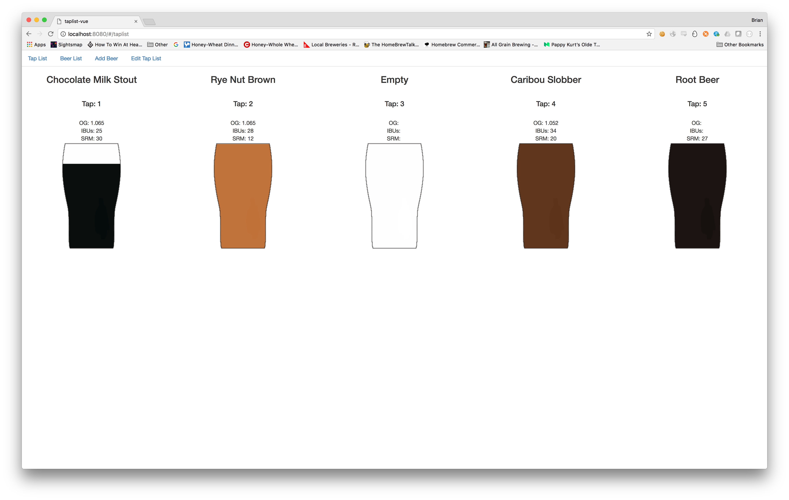
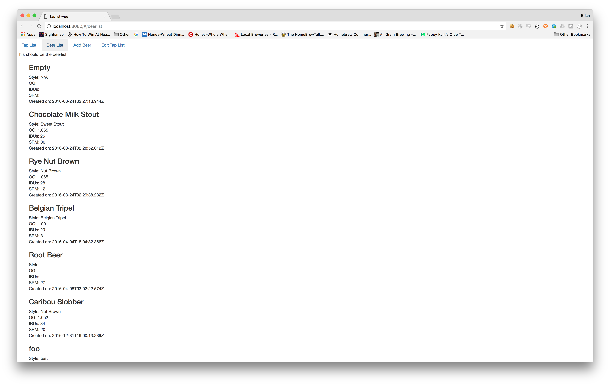
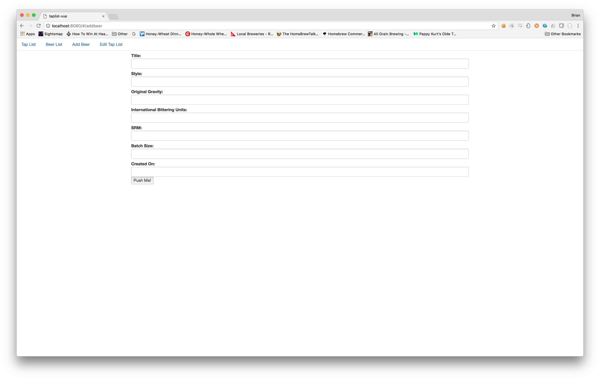
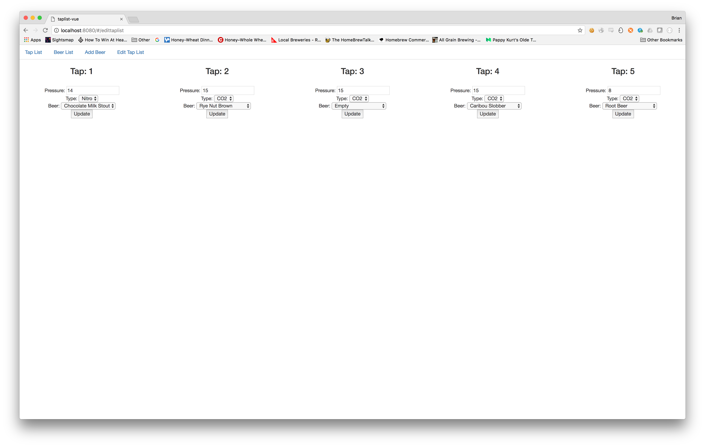

# taplist-vue

> A Vue.js project for a digital taplist.  Frontend code only. 

## Screen Shots
### Tap List

Display a list of the beers you currently have on tap with the fullness of the glass representing how full the keg is and the color representing the SRM of the beer.

### Beer List

Display a list of all the beers you have in the database along with their attributes

### Add Beers

Add beers to the database.  Allows you to set the title, style, Original Gravity, IBUs, SRM, batch size and created date

### Edit Tap List

Assign beers to the tap list and set tap attributes

###

## Build Setup

``` bash
# install dependencies
npm install

# serve with hot reload at localhost:8080
npm run dev

# build for production with minification
npm run build
```

